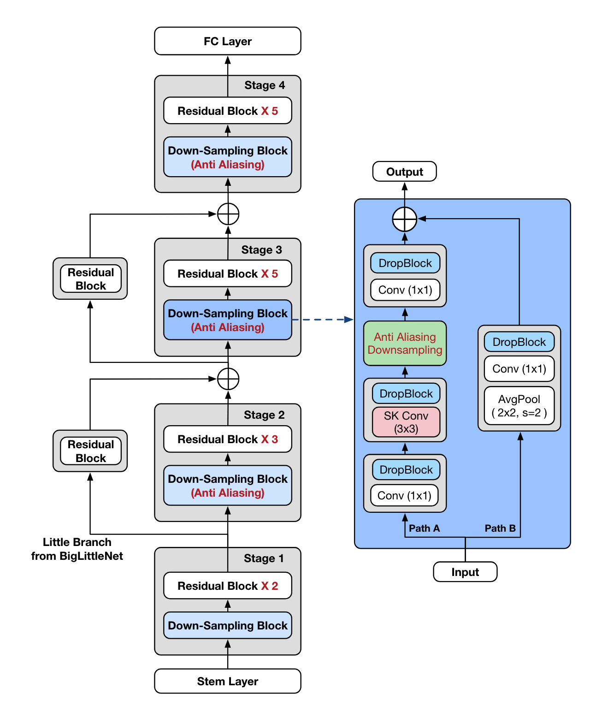
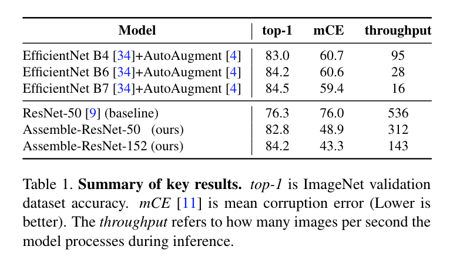
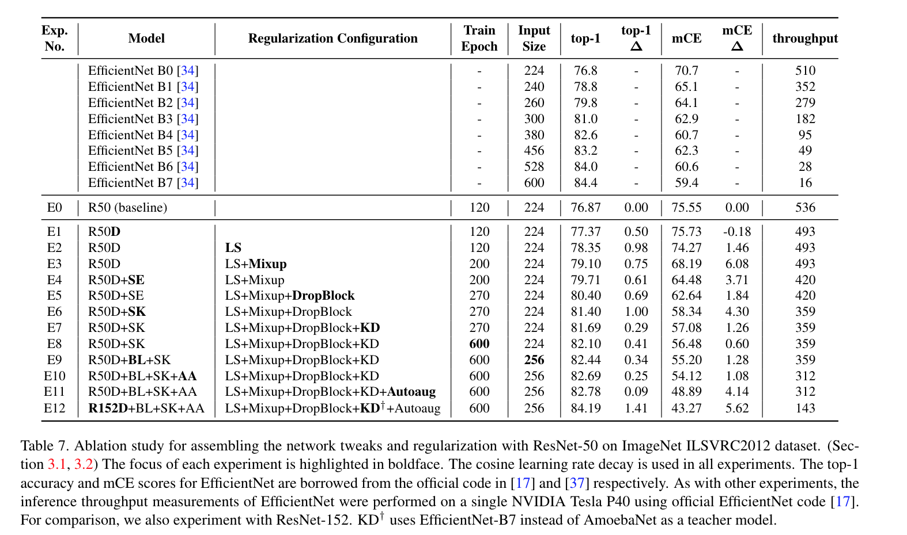
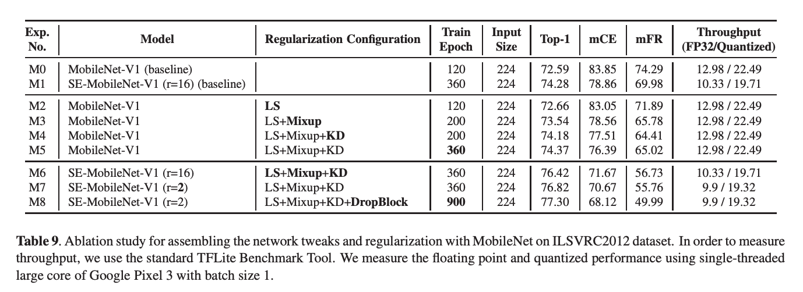
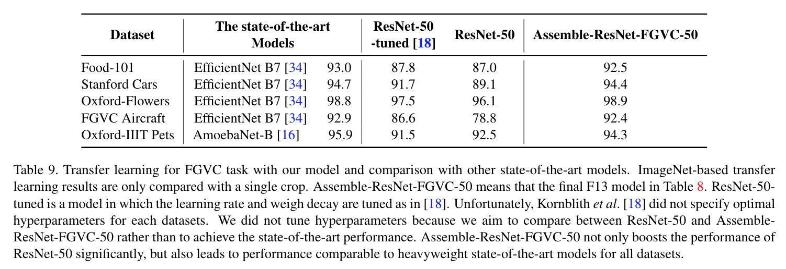

# Compounding the Performance Improvements of Assembled Techniques in a Convolutional Neural Network

## What's New

July 11, 2020
* We reimplemented assemble-resnet with tensorflow 2.1. If you want to see the code with better readability, refer to [this branch](https://github.com/clovaai/assembled-cnn/tree/tf2.1).

[paper v2](https://arxiv.org/abs/2001.06268) | [pretrained model](https://drive.google.com/drive/folders/1o8vj8_ZOPByjRKZzRPZMbuoKyxIwd_IZ?usp=sharing) 

Official Tensorflow implementation  

> [Jungkyu Lee](mailto:jungkyu.lee@navercorp.com), [Taeryun Won](mailto:lory.tail@navercorp.com), [Tae Kwan Lee](mailto:taekwan.lee@navercorp.com), 
> [Hyemin Lee](mailto:hmin.lee@navercorp.com), [Geonmo Gu](mailto:geonmo.gu@navercorp.com), [Kiho Hong](mailto:kiho.hong@navercorp.com)<br/>
> @NAVER/LINE Vision


**Abstract**

> Recent studies in image classification have demonstrated 
a variety of techniques for improving the performance of
Convolutional Neural Networks (CNNs). However, attempts to combine existing techniques to create a practical model are still uncommon. In this study, we carry out
extensive experiments to validate that carefully assembling
these techniques and applying them to basic CNN models (e.g., ResNet and MobileNet) can improve the accuracy
and robustness of the models while minimizing the loss of
throughput. Our proposed assembled ResNet-50 shows improvements in top-1 accuracy from 76.3% to 82.78%, mCE
from 76.0% to 48.9% and mFR from 57.7% to 32.3% on
ILSVRC2012 validation set. With these improvements, inference throughput only decreases from 536 to 312. To verify the performance improvement in transfer learning, fine
grained classification and image retrieval tasks were tested
on several public datasets and showed that the improvement
to backbone network performance boosted transfer learning performance significantly. Our approach achieved 1st place in the iFood Competition Fine-Grained Visual Recognition at CVPR 2019

<p align="center">
  
</p>


## Main Results

### Summary of key results

<p align="center">
 
</p>


### Ablation Study

<p align="center">
  
</p>

<p align="center">
  
</p>

### Transfer learning

<p align="center">
  
</p>


## Honor

* Based on our repository, we achieved 1st place in [iFood Competition Fine-Grained Visual Recognition at CVPR 2019](https://www.kaggle.com/c/ifood-2019-fgvc6/leaderboard).

## Related links

Thankfully some people have written testimonial and  posts related to our paper.

* [Jeremy Howard's  testimonial tweet](https://twitter.com/jeremyphoward/status/1219695492927328256)
* [Stan Kriventsov's summary post](https://dl.reviews/2020/01/26/compounding-resnet-improvements/)
* [akira's summary post](https://medium.com/analytics-vidhya/assemble-resnet-that-is-5-times-faster-with-the-same-accuracy-as-efficientnet-b6-autoaugment-c752f1835c38)
* [norman3(one of authurs)'s korean version paper](https://norman3.github.io/papers/docs/assembled_cnn)

## Tutorial: Fine-Tuning on Oxford-flower102

As first try, you can fine-tune your flower classifier in colab.
 
 [](https://colab.research.google.com/drive/11GJf-frlk_mj30h_cZoRJZ5W6j2lO9HM)


## Getting Started

* This work was tested with Tensorflow 1.14.0, CUDA 10.0, python 3.6.

### Requirements

```bash
pip install Pillow sklearn requests Wand tqdm
```


### Data preparation

We assume you already have the following data:
* ImageNet2012 raw images and tfrecord. For this data, please refer to [here](https://github.com/simnalamburt/models/tree/clovaai-assembled-cnn/research/slim#an-automated-script-for-processing-imagenet-data)
* For knowledge distillation, you need to add the teacher's logits to the TFRecord according to [here](./kd/README.md)
* For transfer learing datasets, refer to scripts in [here](./datasets)
* To download pretrained model, visit [here](https://drive.google.com/drive/folders/1o8vj8_ZOPByjRKZzRPZMbuoKyxIwd_IZ?usp=sharing)
* To make mCE evaluation dataset. refer to [here](./datasets/CE_dataset/README.MD)

### Reproduce Results

First, download pretrained models from [here](https://drive.google.com/drive/folders/1o8vj8_ZOPByjRKZzRPZMbuoKyxIwd_IZ?usp=sharing).

For Assemble-ResNet50, 

```bash
DATA_DIR=/path/to/imagenet2012/tfrecord
MODEL_DIR=/path/Assemble-ResNet50/checkpoint
CUDA_VISIBLE_DEVICES=1 python main_classification.py \
--eval_only=True \
--dataset_name=imagenet \
--data_dir=${DATA_DIR} \
--model_dir=${MODEL_DIR} \
--preprocessing_type=imagenet_224_256 \
--resnet_version=2 \
--resnet_size=50 \
--use_sk_block=True \
--use_resnet_d==False \
--anti_alias_type=sconv \
--anti_alias_filter_size=3 
```

Note that `use_resnet_d==False`.
We have implemented BigLittleNet with reference to the official implementation of [BigLittleNet](https://github.com/IBM/BigLittleNet)
We found that BigLittleNet's official implementation already includes the concept of resnet-d.
that is, in both [`resnet_d_projection_shortcut`](https://github.com/clovaai/assembled-cnn/blob/master/nets/resnet_model.py#L123) and [`bl_projection_shortcut`](https://github.com/clovaai/assembled-cnn/blob/master/nets/resnet_model.py#L133), a average
pooling layer has been added with a stride of 2 before the convolution(except pooling size is different).
So we described it in the paper as D + BL.
However, when using BL, we did not use tweak that replaces 7x7 convolution with three 3x3 conv(so it become `use_resnet_d=False`) because it made training unstable.
I thought it was a little tricky.  We will further explain it in the v2 version of our paper.

For Assemble-ResNet152, 

```bash
DATA_DIR=/path/to/imagenet2012/tfrecord
MODEL_DIR=/path/Assemble-ResNet152/checkpoint
CUDA_VISIBLE_DEVICES=1 python main_classification.py \
--eval_only=True \
--dataset_name=imagenet \
--data_dir=${DATA_DIR} \
--model_dir=${MODEL_DIR} \
--preprocessing_type=imagenet_224_256a \
--resnet_version=2 \
--resnet_size=152 \
--bl_alpha=1 \
--bl_beta=2 \
--use_sk_block=True \
--anti_alias_type=sconv \
--anti_alias_filter_size=3 
```

For Assemble-ResNet 152, `preprocessing_type=imagenet_224_256a`(resize the shorter size of each image to 257 pixels while
the aspect ratio is maintained. Next, we center crop the image to the 256x256 size) performed better.

The expected final output is`

```
...
| accuracy:   0.841860 |
...
```

## Training a model from scratch.

For training parameter information, refer to [here](./nets/hparams_config.py)

Train vanila ResNet50 on ImageNet from scratch.

```console
$ ./scripts/train_vanila_from_scratch.sh
```

Train all-assemble ResNet50 on ImageNet from scratch.

```console
$ ./scripts/train_assemble_from_scratch.sh
```

## Fine-tuning the model.

In the previous section, you train the pretrained model from scratch.
You can also download pretrained model to finetune from [here](https://drive.google.com/drive/folders/1o8vj8_ZOPByjRKZzRPZMbuoKyxIwd_IZ?usp=sharing).

Fine-tune vanila ResNet50 on Food101.

```console
$ ./scripts/finetuning_vanila_on_food101.sh
```

Train all-assemble ResNet50 on Food101.

```console
$ ./scripts/finetuning_assemble_on_food101.sh
```


## mCE evaluation

You can calculate mCE on the trained model as follows: 

```console
$ ./eval_assemble_mCE_on_imagenet.sh
```

 
## Acknowledgements
This implementation is based on these repository:
* resnet official: https://github.com/tensorflow/models/tree/master/official/r1/resnet
* mce: https://github.com/hendrycks/robustness
* autoaugment: https://github.com/tensorflow/tpu/blob/master/models/official/efficientnet/autoaugment.py

## Contact
Feel free to create a issue or contact me if there is any question (Jungkyu Lee jungkyu.lee@navercorp.com).

## Citation

```
@misc{lee2020compounding,
    title={Compounding the Performance Improvements of Assembled Techniques in a Convolutional Neural Network},
    author={Jungkyu Lee, Taeryun Won, Tae Kwan Lee, Hyemin Lee, Geonmo Gu, Kiho Hong},
    year={2020},
    eprint={2001.06268v2},
    archivePrefix={arXiv},
    primaryClass={cs.CV}
}
```

## License

```
   Copyright 2020-present NAVER Corp.

   Licensed under the Apache License, Version 2.0 (the "License");
   you may not use this file except in compliance with the License.
   You may obtain a copy of the License at

       http://www.apache.org/licenses/LICENSE-2.0

   Unless required by applicable law or agreed to in writing, software
   distributed under the License is distributed on an "AS IS" BASIS,
   WITHOUT WARRANTIES OR CONDITIONS OF ANY KIND, either express or implied.
   See the License for the specific language governing permissions and
   limitations under the License.
```
